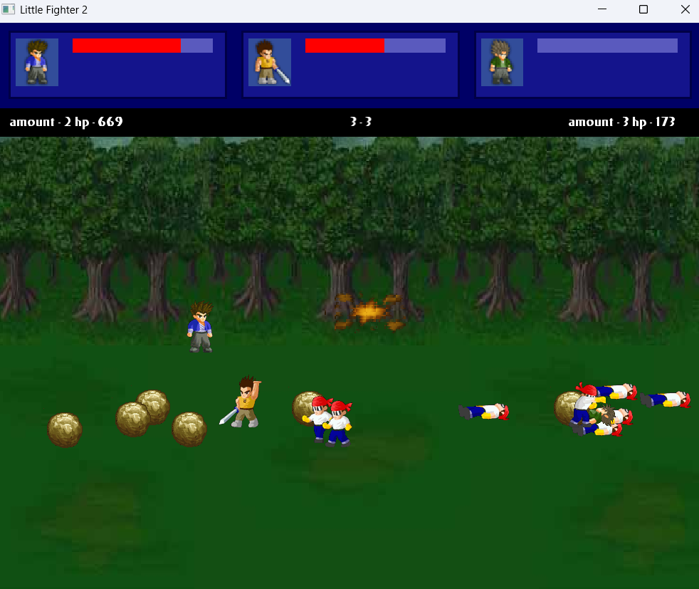

# Little Fighter 2 Duplicate

A modern, C++-based reimplementation of the classic **Little Fighter 2** game using SFML. This project features real-time action gameplay with multiple characters, keyboard input, resource management, and both player and computer-controlled fighters. The codebase is modular, maintainable, and built with principles such as data-driven design, polymorphism, and separation of concerns.

## Authors

- Benny Beer
- Omer Shimoni
- Adam Simonov

---

## Gameplay Overview

- Play as a fighter on a 2D battlefield with enemies and allies.
- Move, attack, and dodge using keyboard controls.
- The game supports win/lose states, loading screens, and computer-controlled behavior.

---

## Project Structure

```
LittleFighter2Duplicate/
│
├── Characters/        # Player, Ally, and Enemy classes
├── Collision/         # Collision resolution logic (multi-method)
├── Management/        # ResourceManager, GameManager, DataLoader
├── Screens/           # Screen flow: Welcome, Game, Win, Lose
├── UI/                # Buttons, Backgrounds, UI elements
├── resources/         # Textures, fonts, data (.dat files)
├── main.cpp           # Game entry point
├── CMakeLists.txt     # Build configuration
```

---

## Data Management System

The game's asset and configuration system is built around 3 core components:

### `ResourceManager`

- A singleton that loads and caches **textures**, **fonts**, and other SFML resources.
- Prevents redundant loading and improves performance.
- Accessed globally via `ResourceManager::instance().getTexture("...")`.

### `LoadingScreen`

- Displays visual feedback while resources and levels are loaded.
- Integrates with the `DataLoader` to show real-time loading progress.
- Smooth transition into the gameplay screen when loading is complete.

### `DataLoader`

- Handles parsing and interpreting the `.dat` files that describe:
  - Character stats
  - Animation frames
  - Map data
- Supports incremental `tickLoad()` logic to avoid freezing the UI.

---

## Computer Player Movement Algorithm

Machine behaviors are distributed across the `Enemy.cpp` and `Ally.cpp` classes:

### `Enemy`

- Calculates the distance to the player.
- Approaches if too far, stops if close enough, and attacks when in range.
- Basic decision logic mimics reactive behavior with movement and attack animations.

### `Ally`

- Similar to Enemy but with different targeting logic (targets enemies only).
- May include follow behavior or cooperative patterns.

Smart movement logic is frame-based and integrates with SFML's timing system.

---

## Collision Handling via Multimethods

Located in `CollisionHandling.cpp`, the collision resolution logic uses **multimethod dispatch**:

- Avoids large `if-else` or `switch` blocks by defining:

```cpp
void handleCollision(Entity& a, Entity& b);
```

- Dispatches based on the runtime types of both `a` and `b`, using method overloading or custom type-matching logic.
- Enables flexible and maintainable collision responses between:
  - Player vs Enemy
  - Playable vs Pickables
  - Ally vs Enemy

---

## Build Instructions

### Prerequisites

- C++17 compiler (GCC, Clang, or MSVC)
- [SFML 2.6.1](https://www.sfml-dev.org/)
- CMake 3.20+

### Build Steps

```bash
git clone https://github.com/yourusername/LittleFighter2Duplicate.git
cd LittleFighter2Duplicate
cmake -B build
cmake --build build
./build/LittleFighter2Duplicate
```

---

## 🎮 Controls

| Key         | Action      |
|-------------|-------------|
| Arrow Keys  | Move        |
| Enter       | Attack      |
| Right Shift | Jump        |
| Left Shift  | Pick Up Item|

---

## Assets and `.dat` Format

- Stored under `resources/`.
- `.dat` files are custom-formatted configuration files parsed by `DataLoader`.
- Textures are organized by character name and animation state.

---

## Key Features

- Modular game state management
- Custom singleton resource manager
- Computer-controlled allies and enemies
- SFML rendering and input handling
- Collision multimethod dispatching
- Clean separation of UI, logic, and rendering

---

## Acknowledgements

Inspired by the original **Little Fighter 2** by Marti Wong & Starsky Wong.
